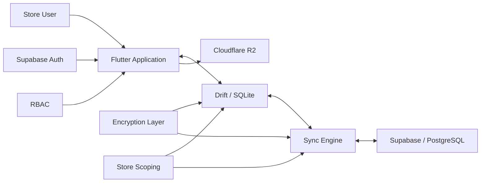
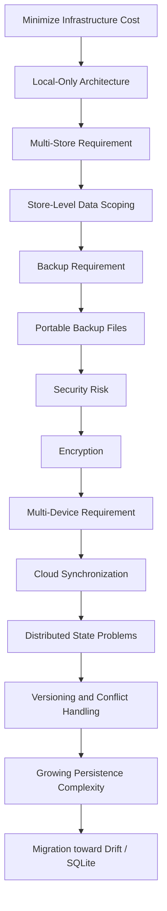
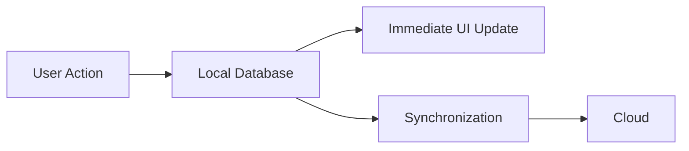
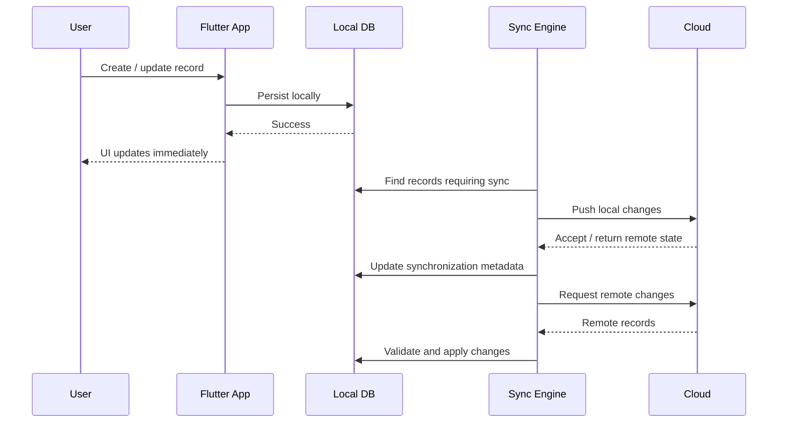
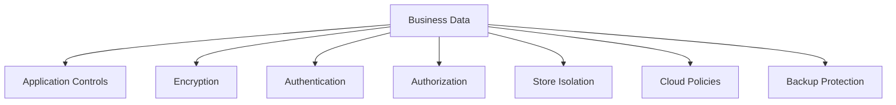
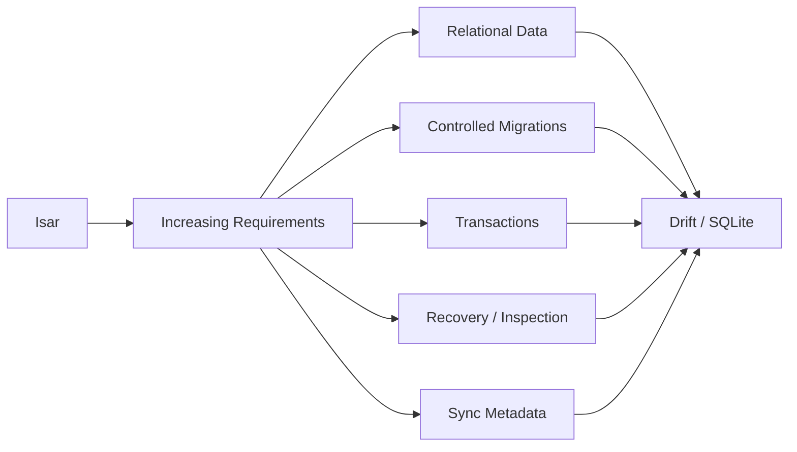

# OptixSuite — Engineering Case Study

> An offline-first, multi-store retail management system built for real optical-store workflows.

OptixSuite began as a simple local application intended to keep infrastructure costs close to zero.

As real business requirements emerged, the architecture had to evolve to support:

* multiple stores;
* multiple devices;
* secure backups;
* encrypted sensitive data;
* cloud synchronization;
* offline operation;
* conflict handling;
* authentication and authorization;
* recovery from synchronization and historical-data failures.

This repository documents that engineering journey.

> **The production source code is private because OptixSuite is a commercial application.**
> This repository focuses on architecture, design decisions, trade-offs, failure modes, and lessons learned without exposing proprietary implementation details.

---

# System Overview

The application follows an **offline-first architecture**.

Normal application operations interact with the local database first. Cloud infrastructure exists to synchronize state between devices, provide authentication, support recovery, and maintain shared multi-store data.

This means temporary loss of connectivity should not prevent ordinary store operations.

---

# What OptixSuite Handles

OptixSuite supports workflows including:

### Inventory

* frames;
* lenses;
* accessories;
* variants;
* stock quantities;
* product identifiers;
* pricing;
* product images.

### Customers

* customer profiles;
* purchase history;
* prescription records;
* order history.

### Orders & Billing

* order creation;
* billing;
* payment tracking;
* order status;
* product allocation.

### Store Operations

* multiple store locations;
* store-scoped data;
* role-based access;
* label and QR/barcode generation;
* backups and recovery.

### Infrastructure

* offline-first persistence;
* cloud synchronization;
* authentication;
* encrypted sensitive fields;
* cloud object storage;
* synchronization recovery.

---

# Why the Architecture Is Interesting

The final architecture was not designed upfront.

Each version solved one set of constraints and exposed another.

The project therefore became less about implementing CRUD screens and more about balancing:

**availability, security, consistency, performance, recovery, cost, maintainability, and business requirements.**

---

# Core Technologies

| Area                       | Technology                                                    |
| -------------------------- | ------------------------------------------------------------- |
| Application                | Flutter / Dart                                                |
| Current Local Persistence  | Drift / SQLite                                                |
| Original Local Persistence | Isar                                                          |
| Cloud Database             | PostgreSQL / Supabase                                         |
| Authentication             | Supabase Auth                                                 |
| Object Storage             | Cloudflare R2                                                 |
| Architecture               | Offline-first                                                 |
| Synchronization            | Version-aware bidirectional synchronization                   |
| Authorization              | Role + store scoped access                                    |
| Security                   | Application-level encryption + infrastructure access controls |

---

# Architectural Principles

## Local-first interaction

The user should normally interact with local data rather than waiting for a network request.

---

## Cloud synchronization is not the UI data source

The cloud exists to distribute state.

It should not unnecessarily become part of the critical interaction path.

This allows the application to continue operating during temporary connectivity failures.

---

## Security belongs at boundaries

Sensitive data should not depend on individual features remembering to encrypt values correctly.

Encryption responsibilities are therefore kept close to persistence and synchronization boundaries.

---

## Store isolation is part of the data model

Multi-store support is not implemented as only a UI filter.

Store ownership must propagate through:

* local queries;
* synchronization;
* authorization;
* cloud access;
* recovery.

---

## Failure is expected

The synchronization system is designed with the assumption that operations may fail due to:

* network loss;
* interrupted synchronization;
* malformed historical records;
* incompatible older data;
* device changes;
* remote failures.

Recovery behavior therefore forms part of the architecture.

---

# Case Study Documentation

## [Architecture Evolution](./docs/architecture-evolution.md)

How OptixSuite evolved from:

**Flutter + Isar → encrypted local system → multi-device offline-first cloud architecture → Drift/SQLite**

This document explains the requirement changes that caused each architectural transition.

---

## [Offline-First Synchronization](./docs/offline-first-sync.md)

Explains:

* local-first writes;
* pull and push flows;
* record identity;
* version tracking;
* synchronization watermarks;
* store isolation;
* conflict handling;
* retries;
* synchronization failure scenarios.

---

## [Security & Encryption](./docs/security-and-encryption.md)

Explains:

* threat model;
* sensitive data handling;
* persistence-boundary encryption;
* backup protection;
* key management considerations;
* cloud authorization;
* encrypted synchronization;
* historical data recovery.

---

## [Design Decisions & Trade-offs](./docs/design-decisions.md)

Documents the reasoning behind major choices including:

* Flutter;
* offline-first architecture;
* Isar;
* migration toward Drift/SQLite;
* Supabase;
* PostgreSQL;
* Cloudflare R2;
* version-based synchronization;
* application-level encryption.

---

# Synchronization Model

A simplified synchronization model looks like:

The important characteristic is that the user-facing operation completes against the **local database**, not the cloud.

---

# Security Model

Security is layered.

No single mechanism is expected to provide complete security.

For example:

* encryption protects confidentiality;
* authentication identifies the user;
* RBAC limits allowed operations;
* store scoping limits accessible business data;
* cloud policies restrict server-side access;
* backup protection reduces exposure outside the application.

---

# Persistence Evolution

OptixSuite originally used **Isar**.

It was a reasonable match for the original constraints:

* local-only operation;
* fast reads and writes;
* simple device-side persistence;
* Flutter integration.

As the architecture became more complex, requirements increasingly favored relational and transactional capabilities.

This migration demonstrates an important engineering principle:

> A technology choice can be correct for the original problem and still become inappropriate after the problem changes.

---

# Repository Scope

This repository intentionally does **not** contain:

* proprietary application source code;
* production credentials;
* encryption keys;
* customer data;
* private database schemas where disclosure would create unnecessary risk;
* security-sensitive implementation details.

The goal is to demonstrate engineering reasoning without compromising the production system.

---

# Key Lessons

Building OptixSuite reinforced several principles.

### Requirements reshape architecture

A change that appears small at the product level can affect the entire system.

### Distributed state is significantly harder than CRUD

Once multiple devices can modify shared data offline, versioning, retries, deletion handling, ordering, and conflict resolution become architectural concerns.

### Reliability and security interact

Making backup files portable improved recoverability but increased the potential exposure of business data.

### Offline-first improves availability but moves complexity elsewhere

The user experience becomes more resilient, while the synchronization layer becomes substantially harder.

### Architecture decisions are contextual

The right database, synchronization model, or infrastructure choice depends on the constraints that exist at that point in the product's evolution.

---

# Project Status

OptixSuite continues to evolve as additional reliability, synchronization, security, and operational requirements are discovered through real usage.

This case study will be updated as major architectural decisions change.
