# Architecture Evolution

OptixSuite did not begin with its current architecture.

The system evolved incrementally as new business requirements exposed limitations in earlier design decisions. Each major architectural change was driven by a concrete problem rather than by adding infrastructure preemptively.

This document describes that evolution.

---

## 1. Initial Constraint: Keep Infrastructure Cost Near Zero

When OptixSuite was initially designed, one of the primary constraints was minimizing recurring infrastructure costs.

The first architecture therefore avoided a backend server entirely.

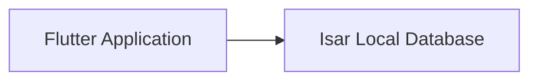

Flutter was chosen because the application needed to support multiple platforms without maintaining separate codebases.

The original local database was **Isar**, selected primarily for its performance and suitability for local-first Flutter applications.

At this stage:

* all application data lived on the device;
* reads and writes were local;
* the application could operate completely offline;
* there were no server costs;
* network availability did not affect normal application usage.

For a single-store application, this architecture was simple and inexpensive.

---

## 2. Requirement Change: Multiple Stores

The initial assumption was that the application would operate within a single store.

The business later clarified that it operated multiple locations.

The first solution appeared straightforward: introduce a `Store` entity and associate business records with a `storeId`.

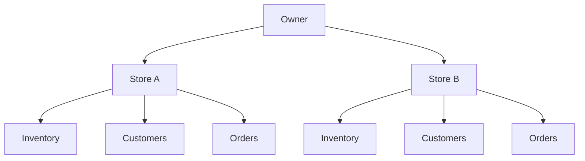

Queries could then scope records by store.

This solved **data separation**, but not **data distribution**.

If Store A and Store B operated on different devices, the data still existed only on whichever device originally created it.

The problem had changed from:

> How do I separate records between stores?

to:

> How do multiple devices maintain access to the correct shared state?

That requirement eventually made a purely device-local architecture insufficient.

---

## 3. Requirement Change: Backup and Recovery

Before introducing full cloud synchronization, another requirement appeared:

> What happens if the device is lost, damaged, or the local database becomes unusable?

A single local copy of the database was not reliable enough.

The backup system therefore introduced multiple copies.

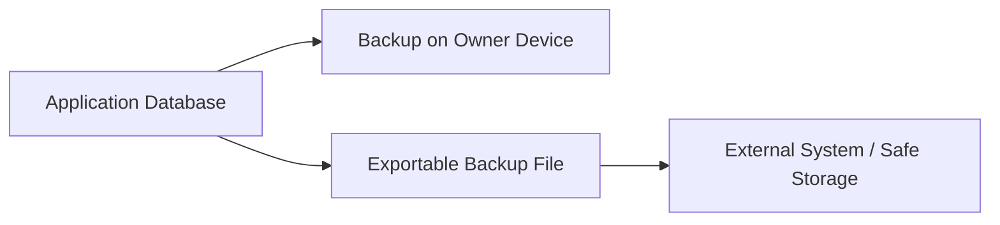

The exported backup could be transferred to another system for safekeeping.

This improved reliability because losing one device no longer necessarily meant losing all business data.

However, it introduced a new security problem.

---

## 4. Reliability Created a Security Problem

Portable backup files meant the database could now leave the controlled environment of the original device.

That changed the threat model.

Previously, an attacker would generally need access to the device or application storage.

With exportable backups, someone who acquired a backup file could potentially inspect business information outside the application.

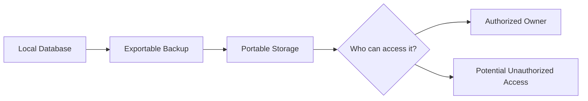

The architecture therefore needed confidentiality guarantees independent of the storage location.

Encryption was introduced around sensitive persisted data.

The important architectural lesson was:

> Increasing availability can reduce confidentiality unless both concerns are designed together.

The backup system solved one failure mode while creating another attack surface.

---

## 5. Application-Level Encryption

The local persistence layer eventually required explicit encryption handling around sensitive fields.

Instead of allowing the rest of the application to manually encrypt values, encryption responsibilities were pushed toward the persistence boundary.

### Write Path

### Read Path

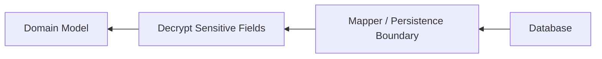

This kept cryptographic concerns out of most business logic and reduced the chance that individual application features would accidentally persist plaintext values.

It also introduced significant complexity around:

* key management;
* migrations;
* historical records;
* recovery;
* malformed ciphertext;
* compatibility with older data;
* backups.

Encryption therefore became an architectural concern rather than a utility function.

---

## 6. Multi-Device Operation Required Cloud State

As multi-store and multi-device requirements became clearer, local backup alone was insufficient.

Backup answers:

> How can lost data be restored?

Synchronization answers a different question:

> How can multiple active devices work with the same evolving dataset?

A cloud data layer was therefore introduced.

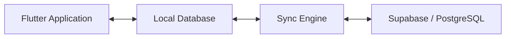

The cloud was not intended to replace local storage for normal application interaction.

Instead, OptixSuite remained **offline-first**.

The application continued reading and writing locally while synchronization propagated changes between the device and server.

---

## 7. Why Offline-First Was Preserved

Moving to the cloud did not mean converting the application into a network-dependent client.

Retail software must continue functioning during:

* poor connectivity;
* temporary ISP outages;
* server interruptions;
* high network latency.

Therefore the local database remained critical.

### OptixSuite Interaction Model

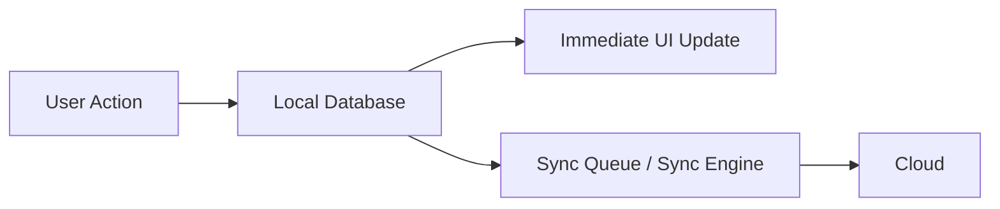

The user does not need to wait for the cloud operation to complete before continuing normal work.

A network-dependent architecture would instead introduce the remote system into the critical user interaction path:

The offline-first architecture improves responsiveness and keeps normal store operations independent of network quality.

The trade-off is that synchronization becomes substantially more complex.

---

## 8. Synchronization Introduced Conflict Resolution

Once both the client and server could contain valid changes, another problem emerged:

> Which version of a record is authoritative?

A simple overwrite strategy could cause legitimate offline changes to disappear.

OptixSuite therefore moved toward versioned synchronization.

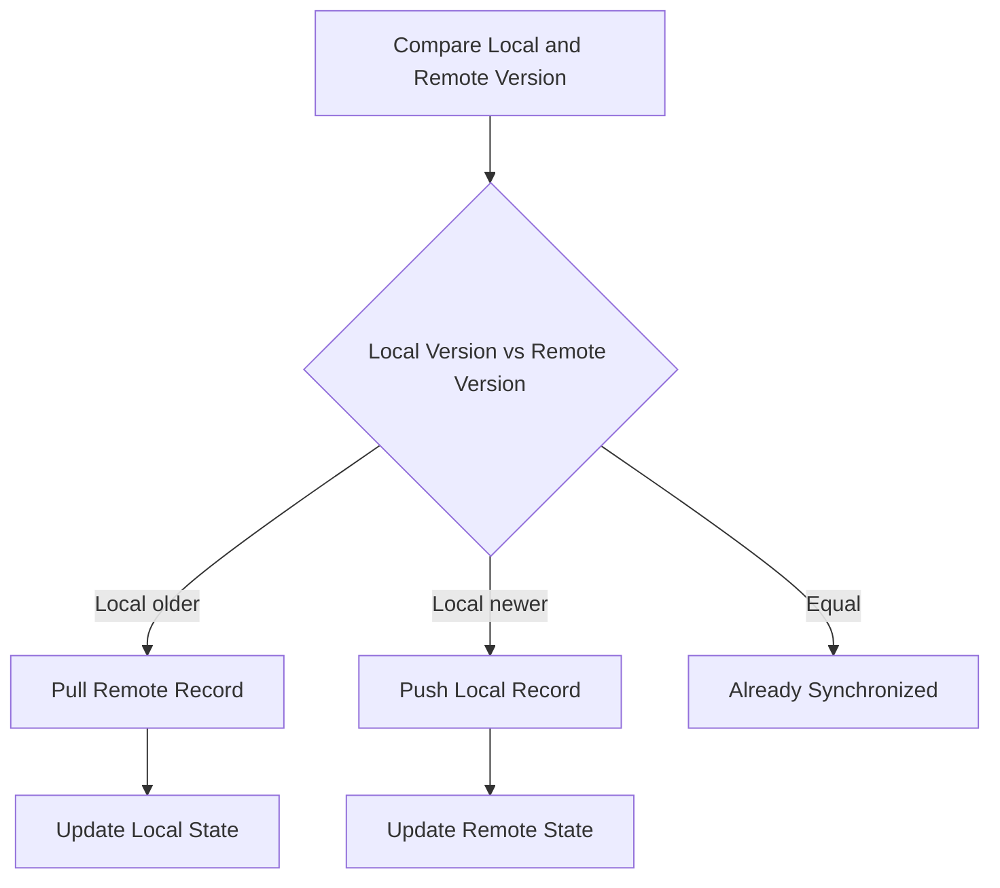

This simplified model expresses the basic version comparison, but the real synchronization system must also account for:

* concurrent updates;
* deleted records;
* synchronization watermarks;
* retries;
* partial failures;
* transaction boundaries;
* device identity;
* store isolation.

Synchronization therefore became its own subsystem rather than scattered networking logic.

---

## 9. Local Persistence Also Evolved

The persistence architecture itself changed as the requirements became more demanding.

The project initially used **Isar** because of its performance and ease of use for local Flutter applications.

As synchronization, relational integrity, migrations, forensic recovery, and more sophisticated data operations became increasingly important, the local persistence layer evolved toward **Drift/SQLite**.

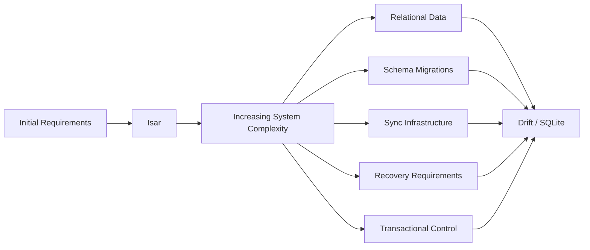

This was not because the original choice was inherently wrong.

Isar matched the constraints of the original architecture.

The requirements changed.

That distinction is important:

> Architecture should be evaluated against the constraints that existed when a decision was made, not only against requirements that appeared later.

---

## 10. Current Architecture

The system eventually evolved into an offline-first architecture where the local database remains the application's immediate source of data while cloud infrastructure provides synchronization and shared state.

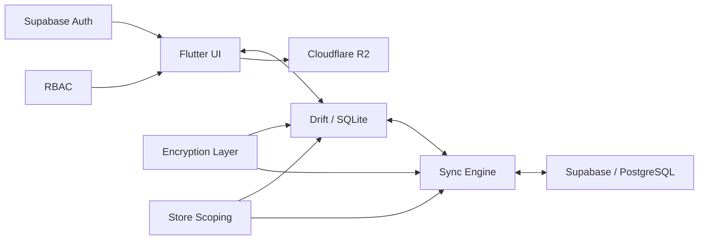

### Responsibilities

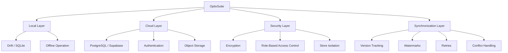

The local database remains the application's immediate data source.

The cloud provides synchronization, shared state, authentication, and recovery capabilities.

---

## 11. Architecture Evolution

The architecture evolved through several distinct stages.

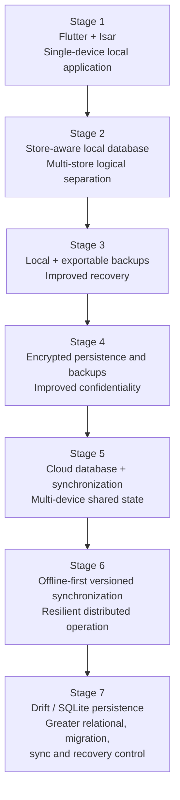

---

## 12. Requirement-to-Consequence Chain

One of the clearest patterns during development was that solving one architectural problem frequently introduced another.

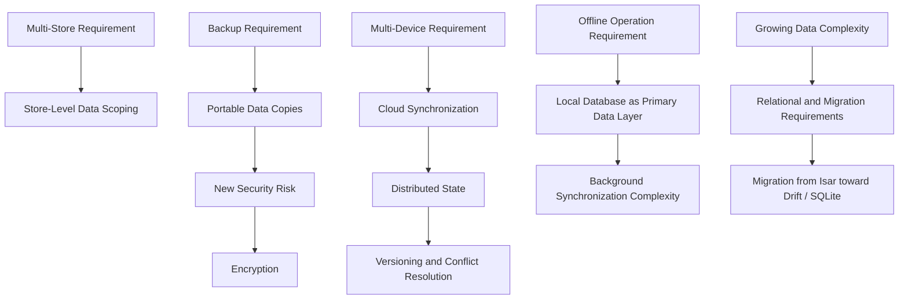

This is one of the major lessons from the project:

**architecture evolves as constraints interact.**

---

## Key Lesson

The most important lesson from OptixSuite's architecture was that software architecture is not a one-time decision.

Every major requirement affected another property of the system.

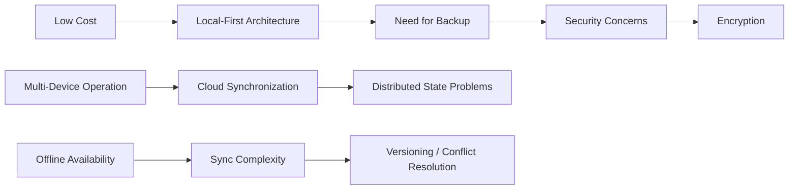

The final architecture is therefore less interesting than the path that produced it.

OptixSuite became a practical exercise in balancing:

**cost, availability, security, performance, consistency, maintainability, and business requirements.**
