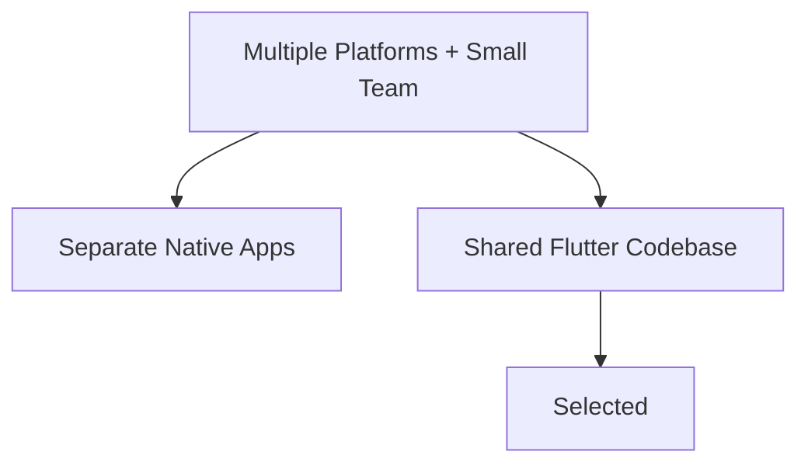
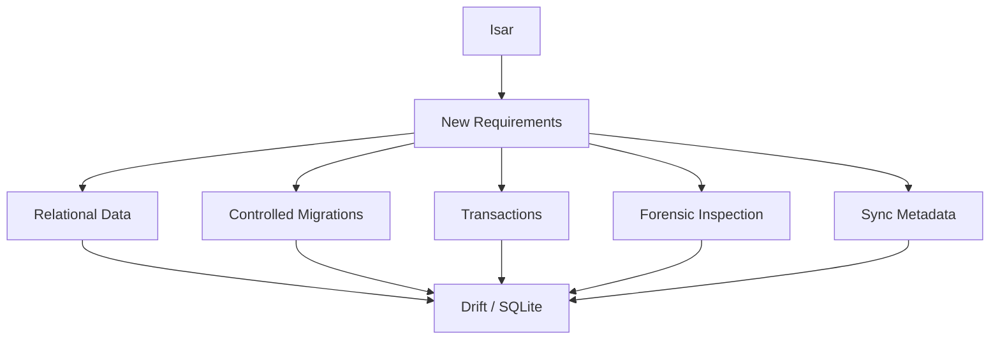
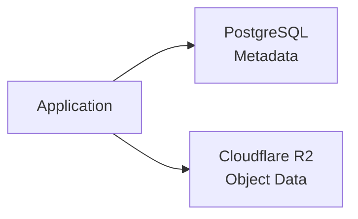
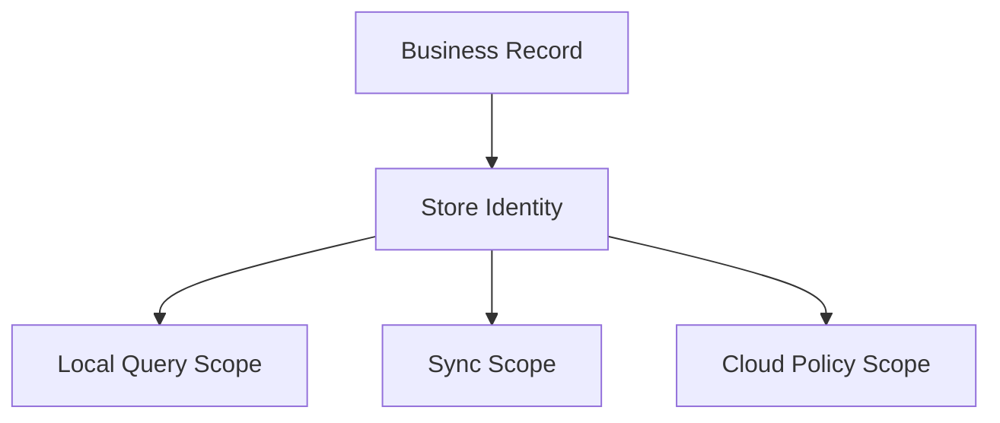
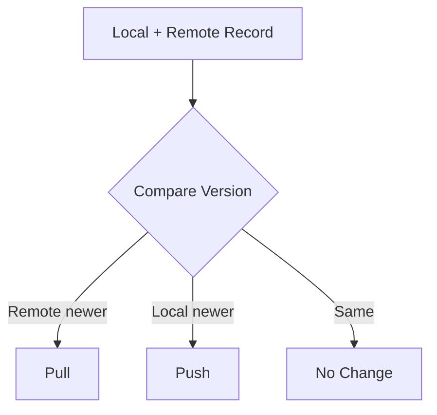
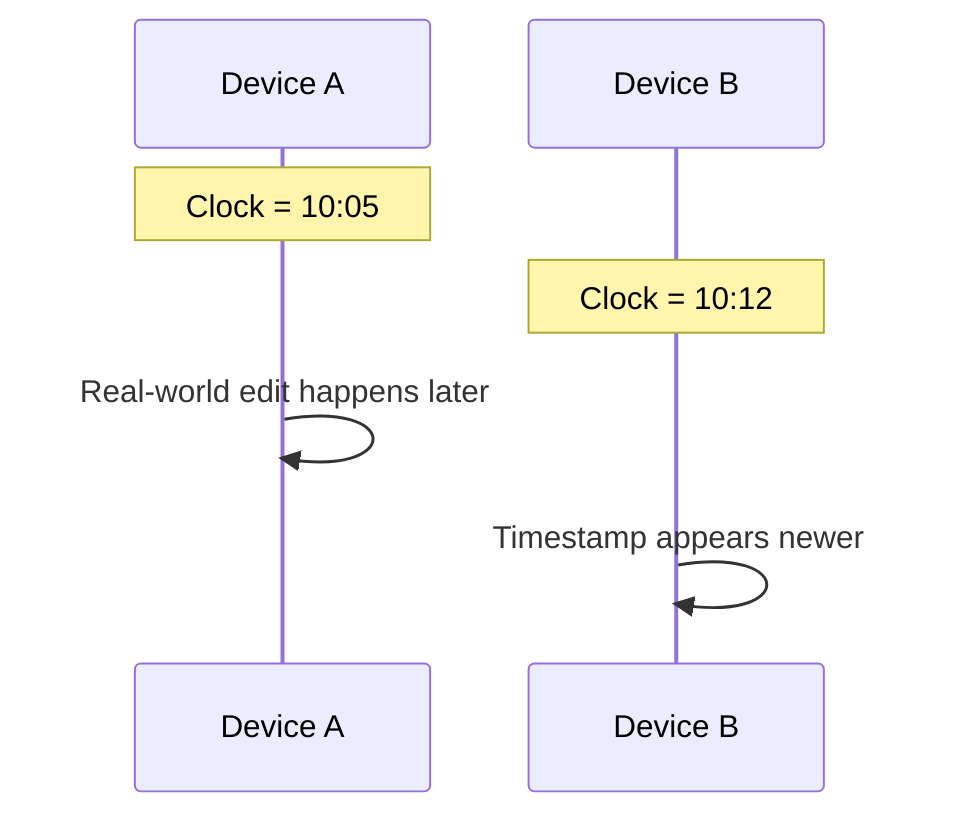
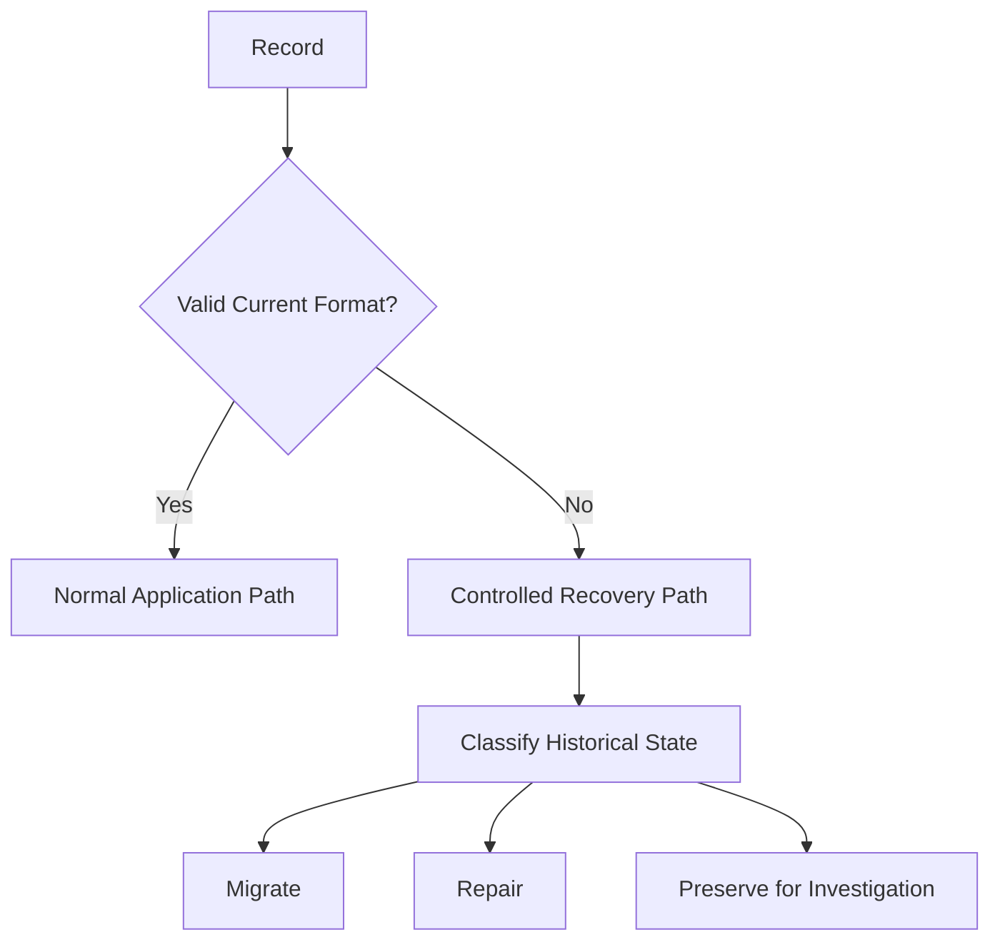
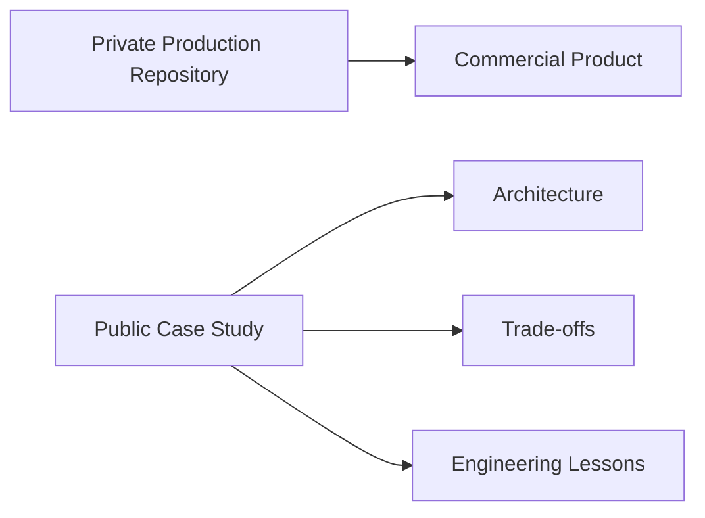
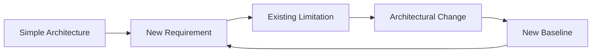

# Design Decisions & Trade-offs

This document records several major architectural choices made during the evolution of OptixSuite.

The goal is not to claim that every decision is universally optimal.

Each decision was made in response to a specific set of constraints.

A useful way to evaluate architecture is:

> **Context → Options → Decision → Benefits → Costs**

---

# Decision 1 — Use Flutter for the Client Application

## Context

The system needed to support business workflows across more than one platform while being developed by a small team.

Maintaining separate native codebases would significantly increase development and maintenance cost.

## Decision

Use **Flutter and Dart** as the primary client stack.

## Benefits

* shared codebase;
* consistent UI;
* strong desktop/mobile potential;
* fast iteration;
* mature local persistence ecosystem.

## Costs

* platform-specific behavior still occasionally requires native work;
* desktop and mobile interaction patterns are not identical;
* some third-party Flutter libraries can introduce platform/build constraints.

---

# Decision 2 — Start Without a Backend

## Context

The initial priority was minimizing recurring infrastructure cost.

The original application did not yet require shared state between active devices.

## Decision

Keep all application data local.

## Benefits

* near-zero infrastructure cost;
* very low latency;
* straightforward deployment;
* complete offline operation;
* fewer moving parts.

## Costs

* no automatic multi-device state;
* device failure threatened data availability;
* backup became necessary;
* centralized administration was impossible.

## Outcome

This was appropriate for the original requirements but became insufficient when multi-store and multi-device operation emerged.

---

# Decision 3 — Choose Isar for the Original Local Database

## Context

The initial persistence requirements emphasized:

* local speed;
* Flutter integration;
* simple object persistence;
* offline operation.

## Decision

Use **Isar**.

## Benefits

* fast local operations;
* developer-friendly Flutter integration;
* good fit for the original local-only architecture.

## Costs That Became More Important Later

As the architecture evolved, the system increasingly needed:

* relational control;
* explicit SQL behavior;
* migrations;
* transaction visibility;
* synchronization metadata;
* forensic recovery;
* easier inspection of persisted state.

These were not necessarily problems when Isar was originally selected.

The requirements changed.

---

# Decision 4 — Move toward Drift / SQLite

## Context

Synchronization and recovery increased the importance of predictable relational persistence.

## Decision

Move the local persistence architecture toward **Drift on SQLite**.

## Benefits

* SQL semantics;
* relational constraints;
* explicit schemas;
* structured migrations;
* transaction support;
* easier low-level inspection;
* strong fit for synchronization metadata.

## Costs

* migration complexity;
* existing data needed careful handling;
* persistence code became more explicit;
* relational design requires more deliberate schema management.

---

# Decision 5 — Preserve Offline-First Operation After Adding Cloud Infrastructure

## Context

Once multiple devices needed shared state, introducing a cloud database was necessary.

One option was to make the server the application's primary data source.

## Decision

Keep the local database as the immediate application source and add cloud synchronization around it.

## Benefits

* application remains usable offline;
* low interaction latency;
* store operations are resilient to network outages;
* cloud failures do not automatically stop local work.

## Costs

* synchronization becomes a distributed-systems problem;
* versioning is required;
* stale state becomes possible;
* retries and recovery become necessary;
* conflict handling becomes a product concern.

---

# Decision 6 — Use Supabase / PostgreSQL for Shared Cloud State

## Context

The cloud layer needed to support:

* structured relational business data;
* authentication;
* multiple stores;
* synchronization;
* server-side authorization.

## Decision

Use **Supabase backed by PostgreSQL**.

## Benefits

* relational database;
* SQL;
* authentication integration;
* server-side access policy support;
* suitable foundation for multi-store data.

## Costs

* infrastructure must be secured correctly;
* synchronization logic remains application-specific;
* cloud schema changes require coordination with clients;
* server availability still matters for cross-device convergence.

---

# Decision 7 — Use Cloudflare R2 for Object Storage

## Context

Relational databases are not ideal storage for arbitrary image files.

Product images and other objects require separate storage.

## Decision

Use **Cloudflare R2** for object storage.

## Benefits

* object storage is separated from structured business data;
* scalable image/file storage;
* database rows can reference object identifiers rather than containing file blobs.

## Costs

* another infrastructure component;
* separate authorization concerns;
* orphaned objects must be handled;
* upload/delete behavior must remain consistent with database state.

---

# Decision 8 — Introduce Explicit Store Scoping

## Context

The business operates multiple stores.

Adding a store selector in the UI does not provide meaningful data isolation.

## Decision

Make store ownership part of the data architecture.

## Benefits

* clearer data ownership;
* easier multi-store filtering;
* stronger synchronization boundaries;
* supports authorization.

## Costs

* store identity must propagate through many models;
* missing `storeId` values become dangerous;
* migrations of old single-store records require care.

---

# Decision 9 — Use Version-Aware Synchronization

## Context

Multiple devices may update the same logical record.

Using only request arrival order would make synchronization unpredictable.

## Decision

Attach synchronization versions or equivalent monotonic state to records.

## Benefits

* synchronization reasoning becomes explicit;
* stale records can be detected;
* less dependence on unreliable device clocks.

## Costs

* concurrent edits still require conflict policy;
* version increments must be correct;
* recovery must preserve metadata.

---

# Decision 10 — Avoid Timestamp-Only Last-Write-Wins

## Context

Last-write-wins based only on `updatedAt` is easy to implement.

However, offline devices do not necessarily have synchronized clocks.

## Decision

Do not rely exclusively on client timestamps for conflict resolution.

## Why

A timestamp does not always prove causality.

## Trade-off

Versioning increases metadata complexity but provides stronger synchronization semantics.

---

# Decision 11 — Encrypt Sensitive Data Near Persistence Boundaries

## Context

If encryption is implemented separately in every feature, it becomes easy to miss a code path.

## Decision

Centralize encryption/decryption around persistence and serialization boundaries.

## Benefits

* consistent policy;
* easier auditing;
* business logic remains simpler;
* fewer opportunities for accidental plaintext persistence.

## Costs

* mappers become security-sensitive;
* migrations become more difficult;
* key failures affect persistence;
* historical data requires careful compatibility logic.

---

# Decision 12 — Protect Exported Backups

## Context

A local-only database is relatively difficult to access without the device.

An exported backup is portable.

## Decision

Treat backups as potentially exposed storage and protect their contents independently.

## Benefits

* copied backup files reveal less useful information;
* backup location does not become the only security boundary.

## Costs

* restoration requires correct key handling;
* key loss can make a backup unusable;
* compatibility across application versions becomes more complicated.

---

# Decision 13 — Separate Recovery Code from Normal Application Paths

## Context

Historical records may contain old formats, malformed ciphertext, or partial migrations.

Making normal application code automatically guess how to recover every malformed record creates risk.

## Decision

Treat forensic/recovery behavior as a deliberate subsystem rather than silently weakening normal parsing rules.

## Benefits

* production behavior remains strict;
* corrupted data is less likely to be silently normalized;
* recovery can be audited independently.

## Costs

* additional tooling and tests;
* recovery procedures are more operationally complex.

---

# Decision 14 — Keep Commercial Source Code Private

## Context

OptixSuite is a commercial product and includes security-sensitive implementation details.

However, keeping the entire project invisible makes it difficult to demonstrate the engineering work publicly.

## Decision

Keep the production repository private while publishing this architecture case study.

## Benefits

* proprietary implementation remains protected;
* architectural reasoning can still be demonstrated;
* security-sensitive details remain private.

## Costs

* reviewers cannot inspect the complete source code;
* documentation must provide enough evidence to be useful without exposing internals.

---

# Decision 15 — Prefer Incremental Architecture Evolution

## Context

It would have been possible to begin with:

* distributed cloud infrastructure;
* complex synchronization;
* encryption;
* multi-store authorization;
* recovery tooling.

But many of those requirements were not initially known.

## Decision

Allow architecture to evolve as constraints became real.

## Benefit

Engineering effort was spent on problems that actually existed.

## Cost

Later requirements caused migrations and refactors.

This is not necessarily architectural failure.

It is a normal consequence of learning more about the problem domain.

---

# Summary

The major OptixSuite decisions can be summarized as:

| Problem                               | Decision                                        |
| ------------------------------------- | ----------------------------------------------- |
| Small team + multiple platforms       | Flutter                                         |
| Minimize initial infrastructure cost  | Local-only architecture                         |
| Fast local persistence                | Isar                                            |
| Increasing relational/sync complexity | Drift / SQLite                                  |
| Shared multi-device state             | Supabase / PostgreSQL                           |
| Unreliable connectivity               | Offline-first architecture                      |
| Product images/files                  | Cloudflare R2                                   |
| Multiple stores                       | Explicit store scoping                          |
| Distributed updates                   | Version-aware synchronization                   |
| Sensitive persisted data              | Boundary-level encryption                       |
| Portable backup files                 | Encrypted backup strategy                       |
| Historical malformed data             | Dedicated recovery paths                        |
| Commercial/IP constraints             | Private source + public architecture case study |

---

# Final Principle

The most important principle behind these decisions is:

> **Architecture is a response to constraints.**

A good architecture is not the one containing the most sophisticated technology.

It is the one whose complexity is justified by the problem it needs to solve.
