# Offline-First Synchronization

OptixSuite uses an offline-first architecture.

The central idea is simple:

> Normal application operations should succeed against the local database without requiring an active connection to the cloud.

Synchronization then propagates changes between devices and the server.

The difficult part is not sending HTTP requests.

The difficult part is maintaining a coherent distributed state when:

* devices can go offline;
* multiple devices can edit data;
* synchronization can fail halfway through;
* records can be deleted;
* old application versions may exist;
* data belongs to different stores;
* encrypted values must survive synchronization correctly.

---

# 1. Local Database as the Immediate Source

Application screens interact with local persistence.

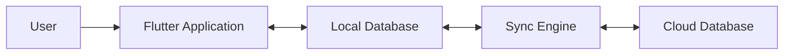

This means normal operations do not depend directly on cloud availability.

For example, when creating a customer:

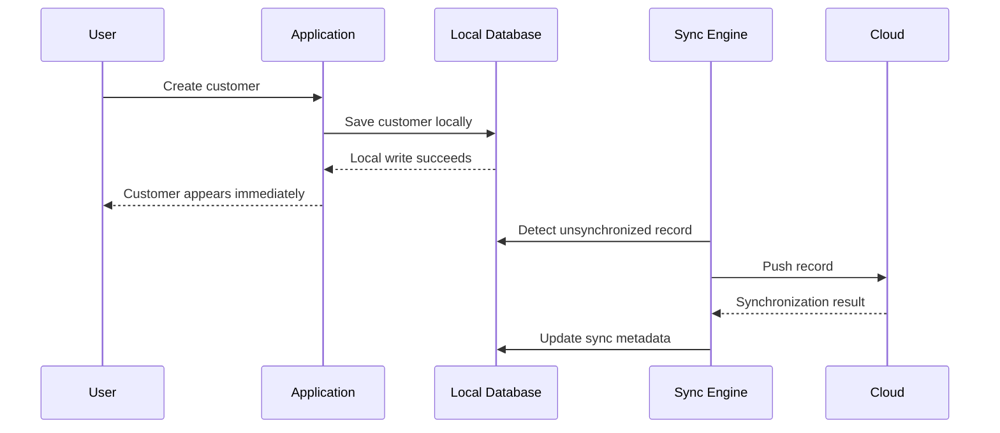

The user does not have to wait for the cloud round trip.

---

# 2. Why Offline-First Matters

Optical stores should remain operational during temporary infrastructure failures.

Possible scenarios include:

* unstable Wi-Fi;
* mobile hotspot usage;
* ISP downtime;
* high latency;
* temporary Supabase unavailability;
* device reconnection after extended offline use.

A cloud-dependent application could turn these events into business interruptions.

Offline-first moves that dependency away from the normal user interaction path.

---

# 3. The Cost of Offline-First

Offline-first does not eliminate complexity.

It relocates it.

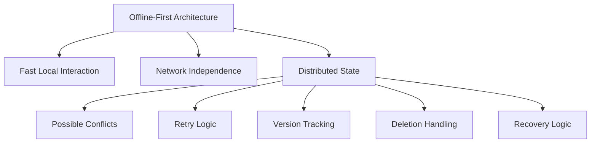

The user experience becomes simpler.

The synchronization system becomes harder.

---

# 4. Record Identity

Synchronization requires a stable identity that exists independently of a device's internal database identifier.

A local database ID is not sufficient because two devices may assign different internal IDs to the same logical record.

Conceptually, synchronized records therefore require a globally stable identifier.

```text
syncUuid
```

or an equivalent globally unique key.

Conceptually:

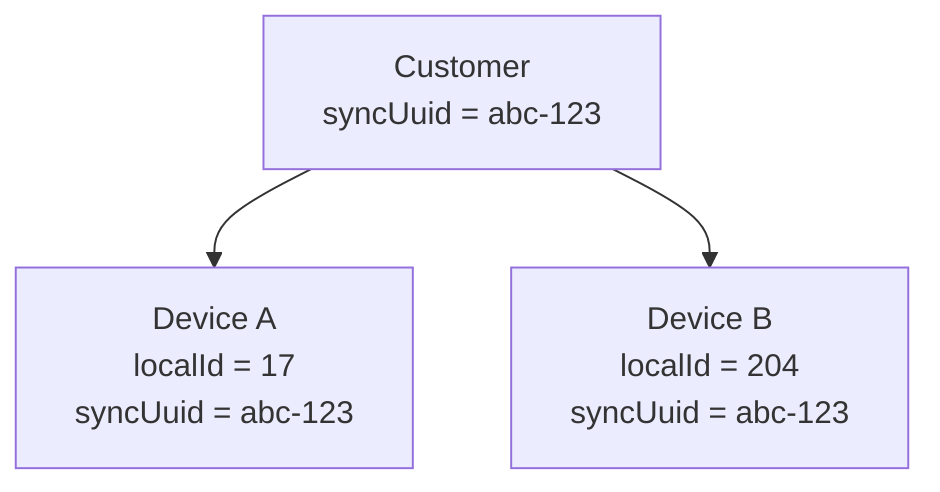

The device-specific IDs may differ.

The synchronization identity must not.

---

# 5. Synchronization Metadata

A synchronized record needs enough metadata to reason about its state.

A simplified conceptual model could include:

```text
syncUuid
storeId
version
updatedAt
deleted
syncStatus
```

The actual production representation can differ, but the system needs equivalent information.

Each field answers a different question.

| Metadata       | Purpose                                    |
| -------------- | ------------------------------------------ |
| `syncUuid`     | Which logical record is this?              |
| `storeId`      | Which store owns the record?               |
| `version`      | Which state is newer?                      |
| `updatedAt`    | When was the record modified?              |
| deletion state | Has the record been intentionally removed? |
| sync state     | Does the device have unsynchronized work?  |

---

# 6. Local Write Flow

A local write should complete independently of the network.

Conceptually:

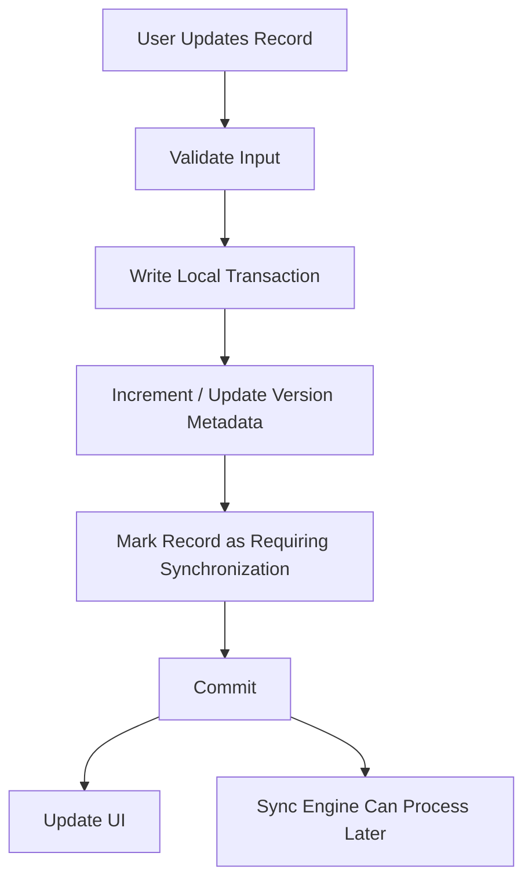

The important property is:

**the network is not part of the local transaction.**

---

# 7. Push Synchronization

Push synchronization identifies local changes that have not yet been propagated to the cloud.

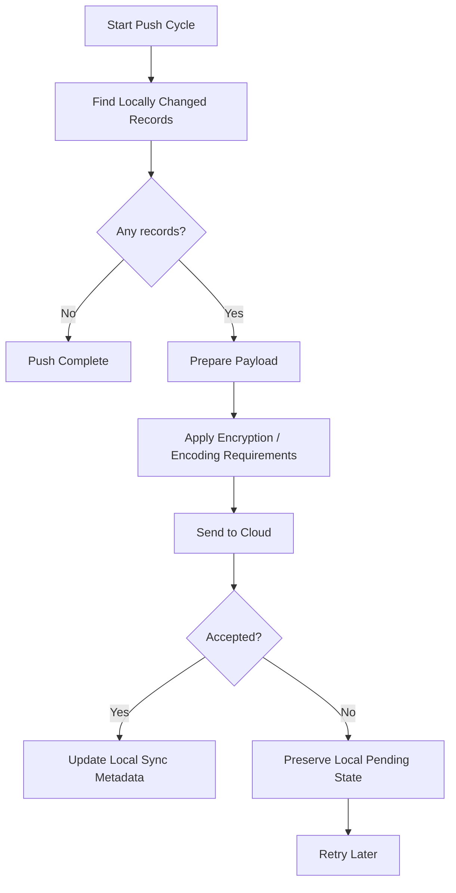

A failed network operation should not cause the local change to disappear.

The unsynchronized state remains until the system successfully reconciles it.

---

# 8. Pull Synchronization

Pull synchronization retrieves remote changes made by other devices.

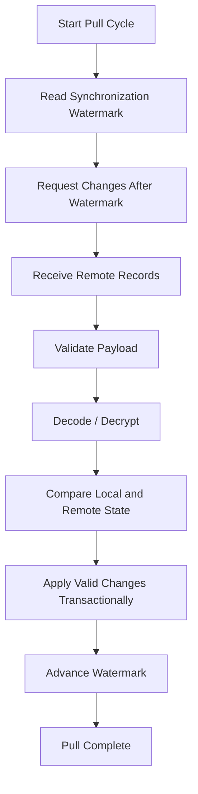

The watermark must only advance when the corresponding remote changes have been handled safely.

Otherwise records could be skipped permanently.

---

# 9. Synchronization Watermarks

A synchronization watermark represents the last safely processed point in the remote change stream.

Conceptually:

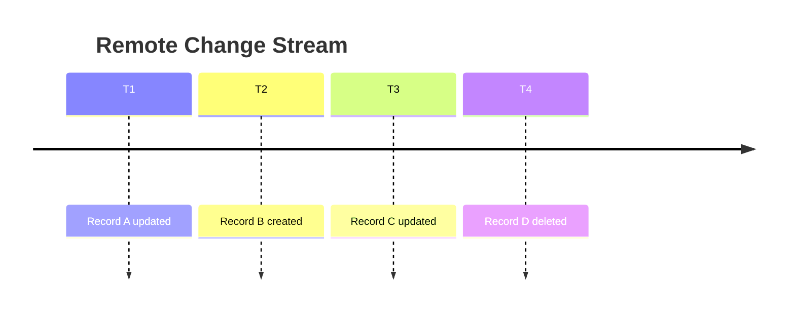

If a device has safely processed through `T2`, its watermark should represent that position.

The next pull should begin after that point.

The important property is:

> The watermark represents successfully processed state, not merely downloaded state.

---

# 10. Why Watermark Ordering Matters

Consider this failure:

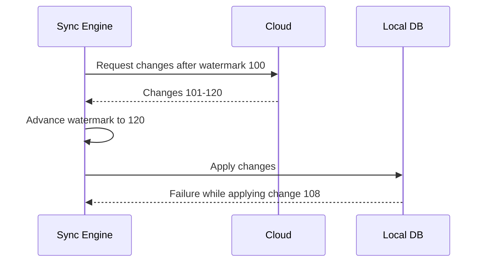

If the watermark was already persisted as `120`, the next synchronization could skip changes `108-120`.

The safer ordering is:

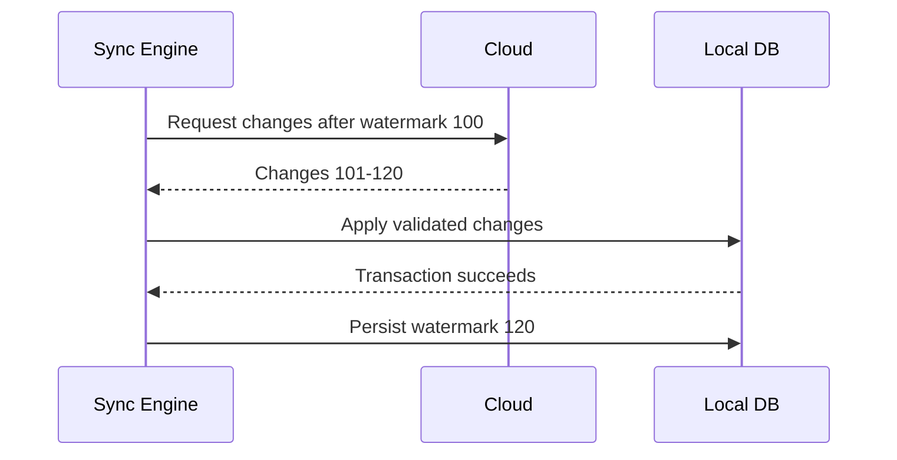

Only confirmed progress should advance synchronization state.

---

# 11. Version-Based Reconciliation

Once multiple devices can modify the same record, the system requires a way to determine which representation is newer.

The simplified model is:

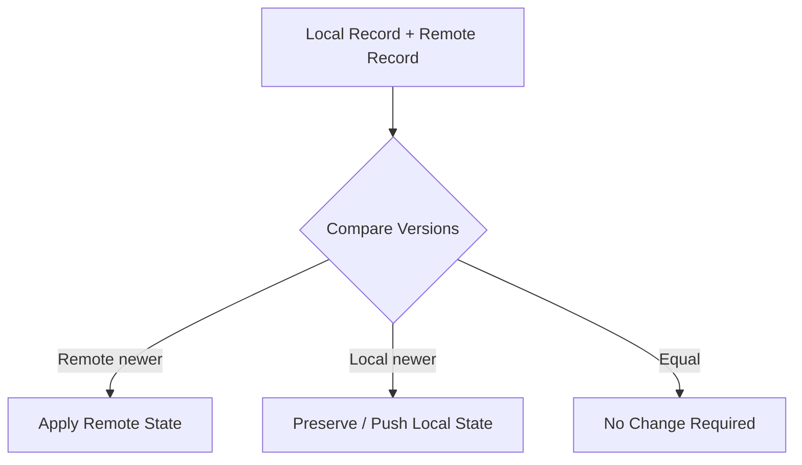

This prevents blindly overwriting state based only on whichever request arrived last.

---

# 12. Why Pure Last-Write-Wins Is Risky

A simple last-write-wins strategy based only on timestamps appears attractive.

However, distributed timestamps can be unreliable because:

* device clocks can differ;
* clocks can be manually changed;
* offline devices may reconnect much later;
* network ordering does not necessarily represent edit ordering.

Version-based state makes the system less dependent on client clock accuracy.

Timestamps can still be useful, but they should not automatically become the only conflict-resolution mechanism.

---

# 13. Conflict Scenarios

Consider:

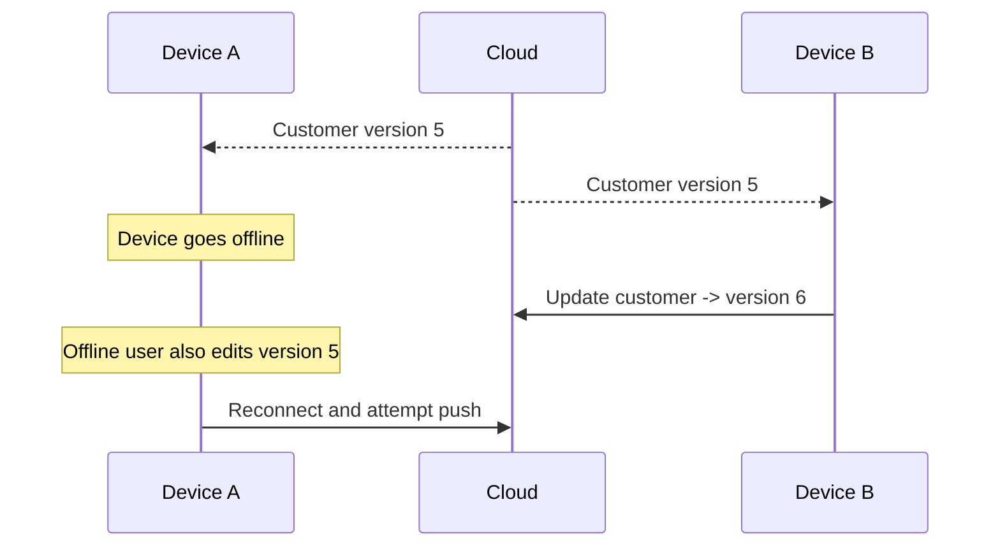

Now two valid edits exist.

The system must determine whether to:

* reject the stale write;
* merge changes;
* preserve both for manual resolution;
* apply a domain-specific rule.

Not all record types necessarily require the same strategy.

Conflict resolution is a business-domain concern as much as a technical one.

---

# 14. Deletes Require Tombstones

Hard-deleting a synchronized record locally can create ambiguity.

Suppose Device A deletes a customer while Device B is offline.

If the cloud simply removes the row, Device B may later reconnect with an older local copy and recreate it.

A common solution is a tombstone or logical deletion marker.

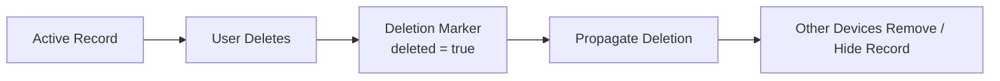

The deletion itself becomes synchronized information.

---

# 15. Multi-Store Isolation

Every synchronization operation must respect store ownership.

It is not enough for the UI to filter records.

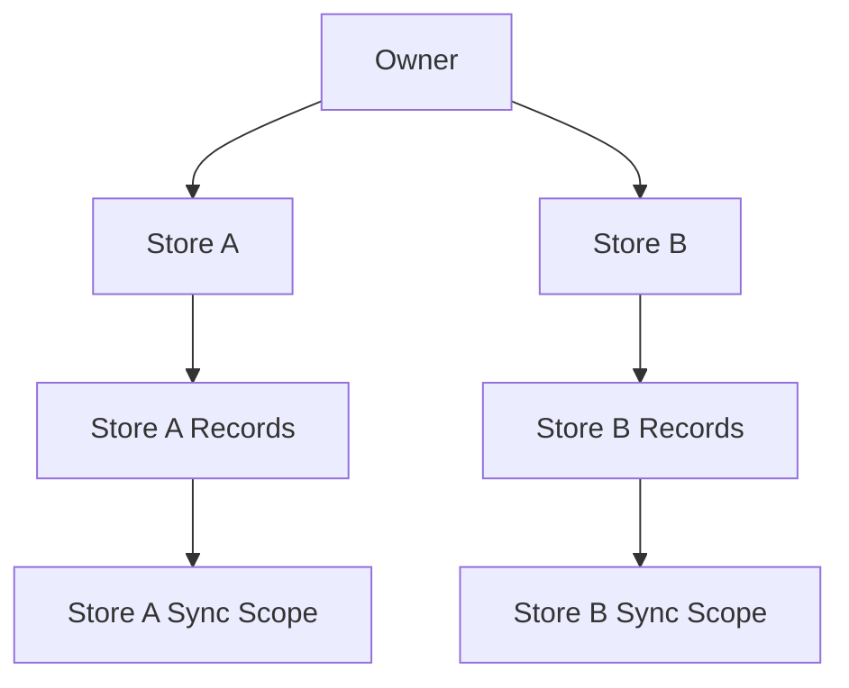

Store identity therefore needs to propagate through:

* record creation;
* local queries;
* synchronization payloads;
* server authorization;
* recovery;
* conflict handling.

This reduces the chance that one store accidentally receives another store's data.

---

# 16. Transaction Boundaries

Applying remote records individually can leave the database partially updated if synchronization fails halfway through.

For related changes, transactional application is preferable.

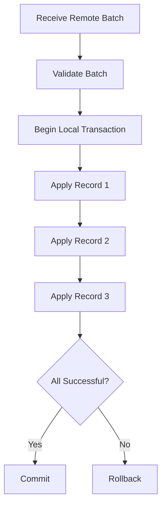

The exact transaction scope depends on record dependencies and batch size.

Large transactions improve atomicity but may increase contention and recovery cost.

---

# 17. Idempotency

Synchronization operations should be safe to retry.

A network failure may occur after the server accepted a request but before the client received the response.

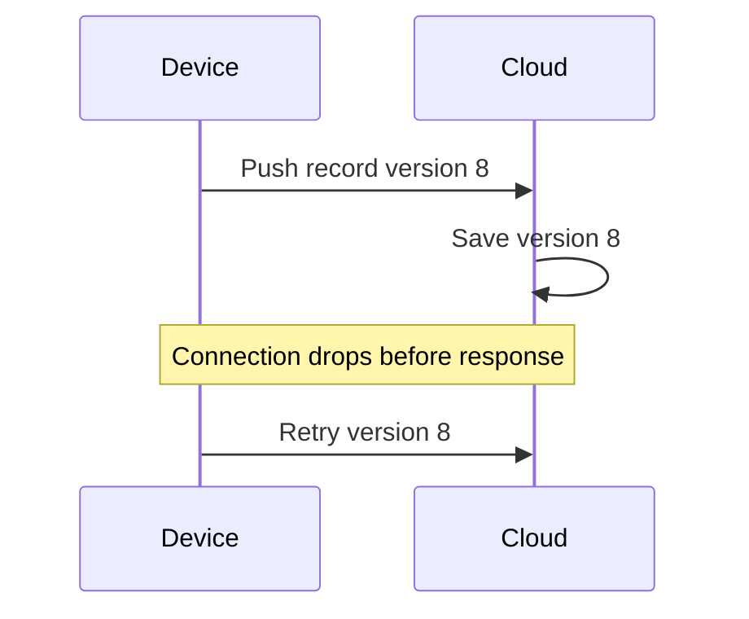

The second request should not produce duplicate logical data.

Stable record identity and version checks help make retries idempotent.

---

# 18. Encryption and Synchronization

Sensitive fields should not become plaintext merely because data is synchronized.

Conceptually:

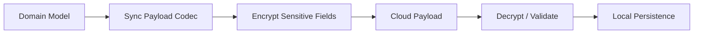

Cryptographic processing must occur at controlled boundaries.

The synchronization engine should not require feature-specific knowledge about which fields are sensitive.

---

# 19. Failure Handling

Synchronization can fail for many reasons.

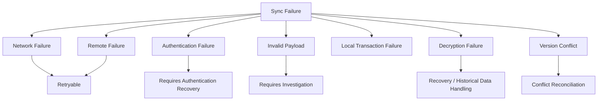

A robust sync engine therefore needs to distinguish between:

**retryable failures** and **structural failures**.

Blind retries cannot solve corrupted or incompatible data.

---

# 20. Fresh Device Synchronization

A newly installed device has no meaningful local synchronization state.

Its first synchronization is therefore closer to initialization than incremental synchronization.

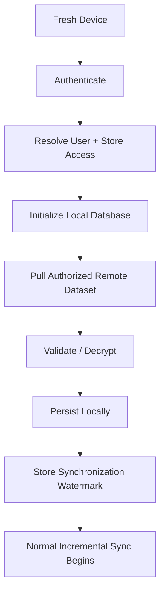

Fresh-device behavior must be tested separately from existing-device synchronization because the assumptions are different.

---

# 21. Recovery and Historical Data

Real systems eventually accumulate records created by older versions of the application.

That creates compatibility challenges.

Historical data may contain:

* older schemas;
* legacy encryption formats;
* missing metadata;
* partially migrated values;
* records produced by previous synchronization logic.

The synchronization system therefore requires recovery paths that distinguish between:

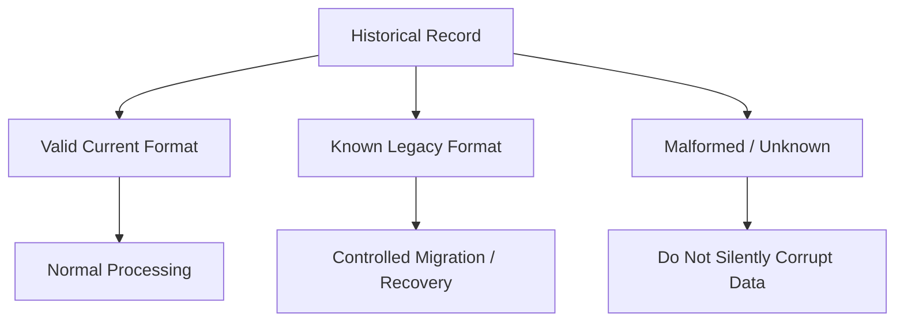

The safest response to unknown data is not always "try harder to parse it."

Sometimes the correct behavior is to stop, preserve evidence, and recover deliberately.

---

# 22. Testing Strategy

Synchronization requires more than happy-path unit tests.

Important cases include:

### Normal behavior

* create locally then push;
* update remotely then pull;
* no-op when versions match.

### Connectivity

* connection drops before request;
* connection drops after server accepts request;
* device remains offline for extended periods.

### State conflicts

* local newer;
* remote newer;
* both modified from the same base version.

### Isolation

* Store A cannot pull Store B data;
* store identifiers cannot be accidentally removed from payloads.

### Recovery

* malformed encrypted field;
* legacy plaintext;
* partially migrated record;
* invalid synchronization watermark.

### Device lifecycle

* fresh installation;
* restored backup;
* returning device;
* removed/re-authorized device.

---

# 23. Synchronization Invariants

Several invariants help reason about correctness.

### Invariant 1

A successful local user action must not depend on immediate cloud availability unless the operation inherently requires the server.

### Invariant 2

A failed push must not silently mark unsynchronized local changes as synchronized.

### Invariant 3

The pull watermark must never advance beyond safely processed remote state.

### Invariant 4

A retry must not create duplicate logical records.

### Invariant 5

Store isolation must hold locally and remotely.

### Invariant 6

Synchronization must not silently convert encrypted sensitive data into plaintext.

### Invariant 7

Unknown or malformed historical records must not silently overwrite healthy data.

---

# Key Lesson

Offline-first architecture provides a strong user experience because application availability is decoupled from network availability.

But this creates a distributed system.

```mermaid
flowchart LR
    OFFLINE[Offline Capability]
        --> MULTIPLE[Multiple Independent States]

    MULTIPLE --> SYNC[Need for Synchronization]

    SYNC --> CONFLICT[Conflicts]
    SYNC --> RETRY[Retries]
    SYNC --> VERSION[Versioning]
    SYNC --> RECOVERY[Recovery]
    SYNC --> TESTING[More Complex Testing]
```

The architecture is therefore a trade:

> **Less operational dependency on the network in exchange for substantially more synchronization complexity.**

For OptixSuite, that trade is worthwhile because store operations should remain available even when connectivity is unreliable.
