# Security & Encryption

Security became a major architectural concern in OptixSuite because the application stores business and customer information across devices, backups, and cloud infrastructure.

The security model evolved alongside the product.

It was not sufficient to add authentication after the application was already working.

Security had to exist across:

* local persistence;
* exported backups;
* synchronization;
* authentication;
* authorization;
* multi-store isolation;
* cloud infrastructure;
* recovery.

---

# 1. Threat Model

The first step is identifying what needs protection and from whom.

OptixSuite has several important data locations.

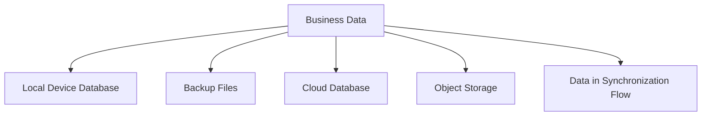

Potential threats include:

* unauthorized access to a store device;
* stolen or copied backup files;
* users accessing operations beyond their role;
* one store accessing another store's data;
* cloud misconfiguration;
* leaked credentials;
* historical plaintext data;
* corrupted encrypted records;
* accidental exposure through logs or debugging tools.

---

# 2. Security Is Layered

Encryption alone does not secure the system.

Authentication alone does not secure it either.

OptixSuite therefore treats security as several independent layers.

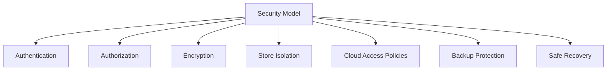

Each layer protects against a different class of failure.

---

# 3. Authentication vs Authorization

These are separate concerns.

## Authentication

Answers:

> Who is this user?

Supabase Auth provides the identity layer.

## Authorization

Answers:

> What is this authenticated user allowed to do?

Authorization depends on business roles.

Conceptually:

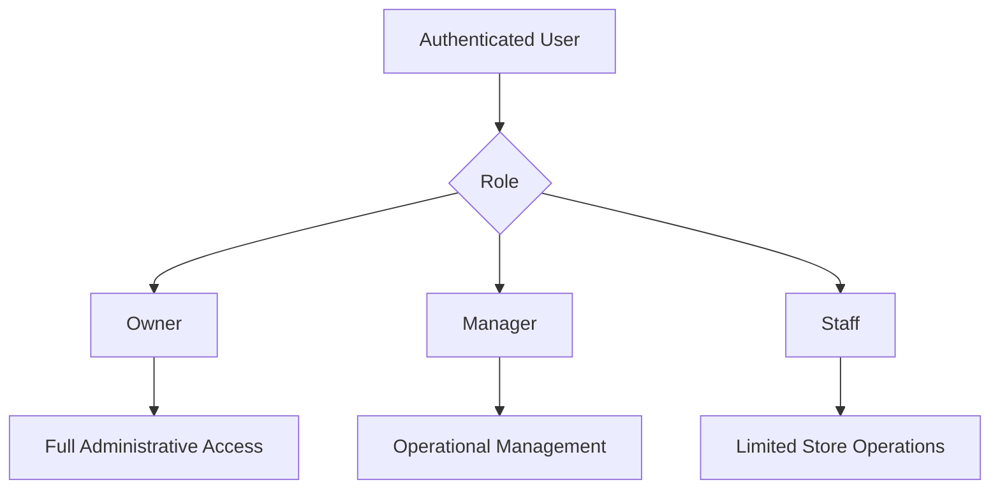

An authenticated user should never automatically gain unrestricted application access.

---

# 4. Role-Based Access Control

The application uses business-oriented roles such as:

* Owner;
* Manager;
* Staff.

Permissions differ by role.

Conceptually:

| Capability                | Owner |    Manager |      Staff |
| ------------------------- | ----: | ---------: | ---------: |
| View inventory            |     ✓ |          ✓ |          ✓ |
| Modify stock              |     ✓ |          ✓ |          ✓ |
| Create customer           |     ✓ |          ✓ |          ✓ |
| Delete customer           |     ✓ | Restricted | Restricted |
| Create order              |     ✓ |          ✓ |          ✓ |
| Delete order              |     ✓ | Restricted | Restricted |
| Full dashboard            |     ✓ |    Limited |    Limited |
| Settings / administration |     ✓ | Restricted | Restricted |

The exact permission model can evolve independently of this public documentation.

The important architectural point is:

> Authorization should be enforced by policy, not hidden UI buttons alone.

---

# 5. Store Isolation

A user may have a valid account but still should not have unrestricted access to every store.

Store scoping therefore acts as another authorization boundary.

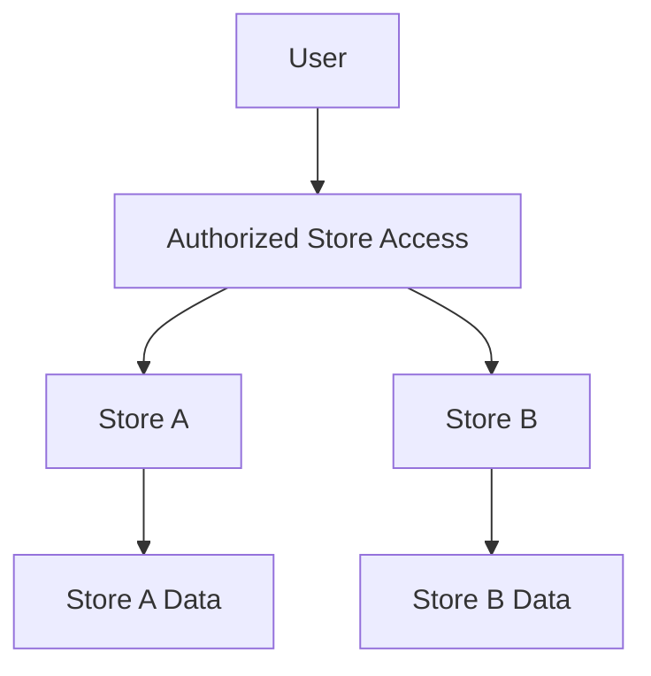

Store identity must be preserved through:

* database rows;
* local queries;
* synchronization payloads;
* remote queries;
* authorization checks.

Filtering only at the user interface would not provide meaningful isolation.

---

# 6. Why Backup Changed the Threat Model

Initially, data stayed inside the application database on one device.

Backup introduced portability.

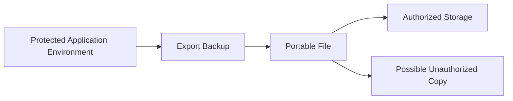

This creates a simple problem:

> If someone can copy the backup file, can they read the business data without the application?

That requirement motivated stronger encryption around persisted and exported data.

---

# 7. Encryption at the Persistence Boundary

Sensitive fields should not rely on every feature manually calling encryption utilities.

Instead, cryptographic behavior belongs close to the persistence boundary.

## Write Path

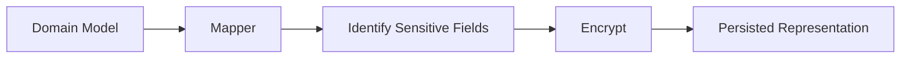

## Read Path

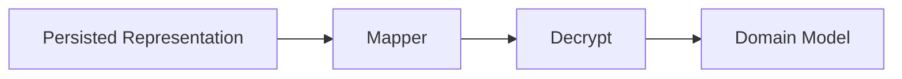

The domain layer works with usable values.

The persistence layer is responsible for protecting sensitive representations.

---

# 8. Why Centralized Encryption Matters

Without a centralized boundary:

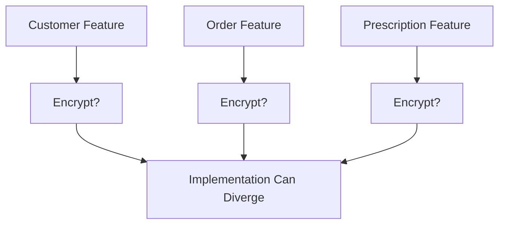

One missed code path could persist plaintext.

A centralized policy reduces this risk.

---

# 9. Field Classification

Not every value necessarily needs identical protection.

Sensitive data should be identified intentionally.

Conceptually:

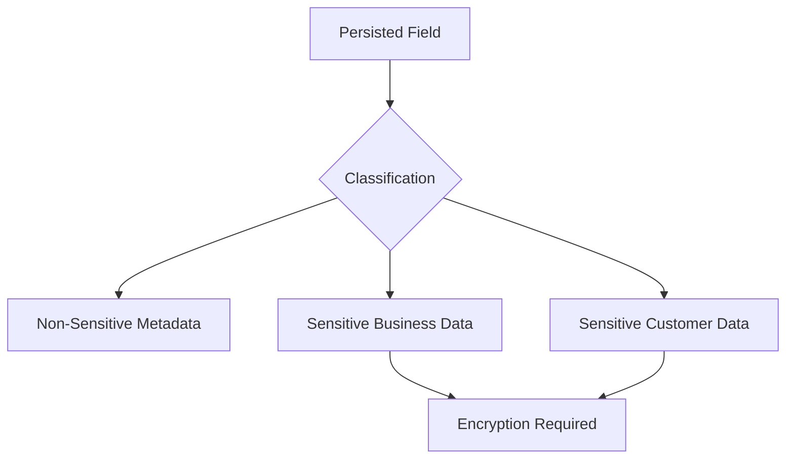

A central field registry or equivalent mechanism makes encryption policy inspectable rather than implicit.

---

# 10. Key Management

Encryption is only as strong as key handling.

A secure design must consider:

* where keys originate;
* where they are stored;
* which store or user they belong to;
* how devices receive them;
* what happens after logout;
* what happens if a device is revoked;
* whether backups can be restored on another authorized device;
* whether keys can be rotated.

Conceptually:

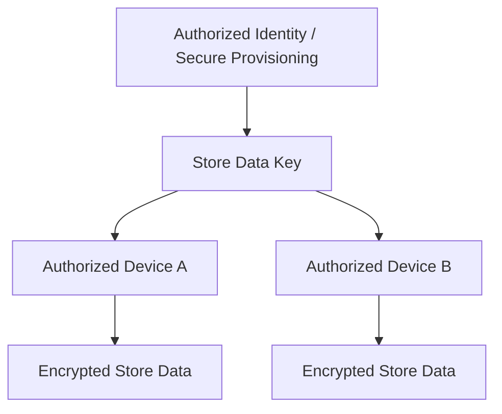

The production key-handling implementation is intentionally not exposed in this public case study.

---

# 11. Encryption Does Not Replace Access Control

Suppose an authenticated staff user legitimately receives the key required for normal application operation.

Encryption alone cannot decide whether that staff member should be allowed to delete an order.

Therefore:

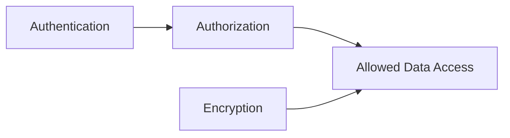

Authentication, authorization, and encryption solve different problems.

---

# 12. Encrypted Synchronization

Synchronization introduces another boundary where sensitive data can accidentally be transformed.

A safe conceptual pipeline is:

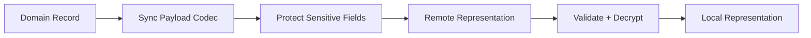

The synchronization layer should maintain clear rules about:

* which representation is plaintext;
* which representation is encrypted;
* where conversion occurs;
* how malformed ciphertext is handled.

---

# 13. Historical Encryption Compatibility

Encryption formats can evolve.

A system may therefore encounter:

* current ciphertext;
* legacy ciphertext;
* historical plaintext;
* malformed encrypted values.

Blindly assuming every stored string uses the current encryption format can destroy recoverability.

A safer classification model is:

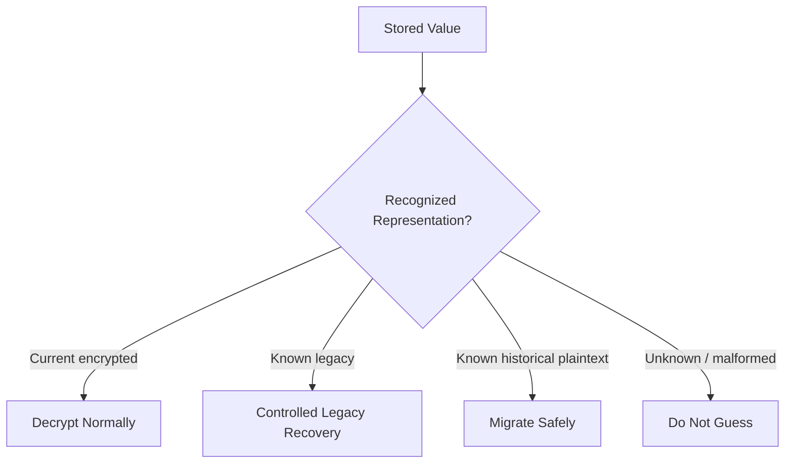

Unknown data should not be silently rewritten.

---

# 14. Why `decrypt-or-raw` Patterns Are Dangerous

A tempting compatibility helper is:

> Try to decrypt the value. If decryption fails, assume the original value was plaintext.

This can be useful during a tightly controlled migration.

But as a permanent architecture pattern, it is dangerous.

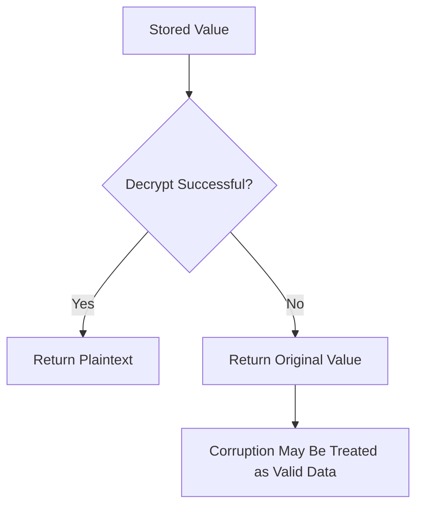

A failed decryption can mean:

* plaintext legacy data;
* wrong key;
* corrupted ciphertext;
* truncated data;
* schema mismatch;
* implementation bug.

These states should not automatically become equivalent.

Recovery logic should distinguish them explicitly.

---

# 15. Backup Protection

Backups need independent protection because they can exist outside the application environment.

A backup pipeline should conceptually follow:

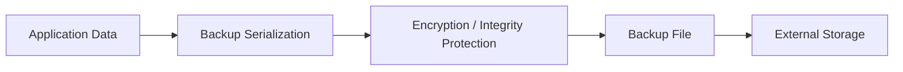

The security of the backup must not depend solely on the filesystem where the owner happens to save it.

---

# 16. Cloud Authorization

Cloud databases need server-side protections even when the client already implements RBAC.

Client-side checks can be modified by an attacker controlling their own device.

Therefore server-side policy should independently validate access.

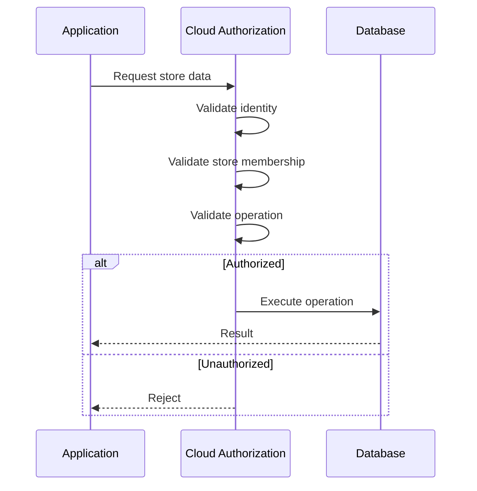

For Supabase, this type of responsibility belongs in carefully designed database access policies and server-side controls.

---

# 17. Object Storage Security

Product and customer-related images may live separately from relational data.

Using object storage therefore creates another authorization surface.

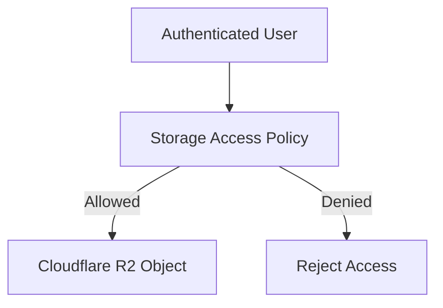

Object identifiers should not be treated as authorization.

Knowing a file name should not automatically mean someone is permitted to retrieve it.

---

# 18. Logging and Diagnostics

Debugging encrypted systems creates its own security risk.

Logging entire records can accidentally expose sensitive plaintext.

Logs should therefore prefer:

* record IDs;
* synchronization UUIDs;
* error classes;
* state transitions;
* non-sensitive metadata.

Instead of:

* complete customer records;
* decrypted fields;
* encryption keys;
* authentication tokens.

---

# 19. Security Failure Categories

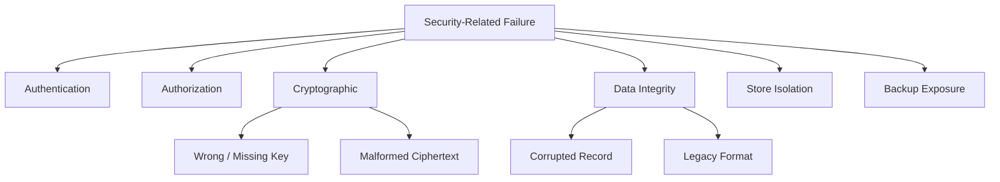

Different failure classes require different recovery behavior.

---

# 20. Security Invariants

Several invariants help keep the architecture understandable.

### Invariant 1

Sensitive fields should not be persisted as plaintext through normal current-version application flows.

### Invariant 2

A user should never gain a permission merely because the UI exposes the corresponding button.

### Invariant 3

Store membership must be enforced beyond UI filtering.

### Invariant 4

Encryption keys must never be logged or committed to source control.

### Invariant 5

Synchronization must preserve the intended encrypted/plaintext boundary.

### Invariant 6

Unknown decryption failures must not automatically be interpreted as valid plaintext.

### Invariant 7

Backup confidentiality must not depend on the backup remaining on one trusted device.

---

# Key Lesson

Security architecture expanded as data became more portable and distributed.

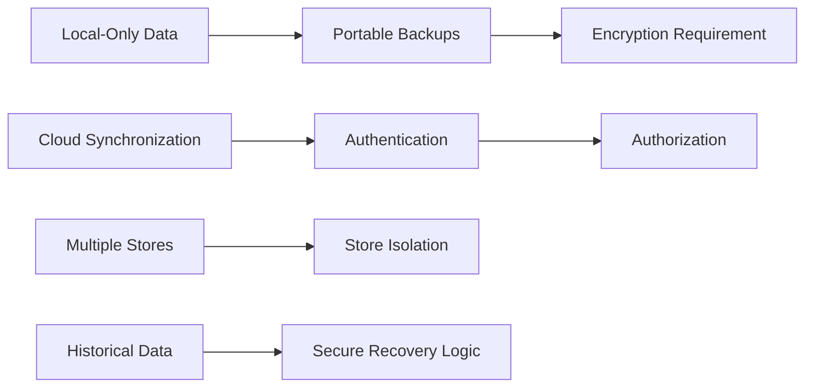

The main lesson was:

> Security is not a feature added after architecture.
> It changes how data is stored, synchronized, backed up, recovered, and accessed.
